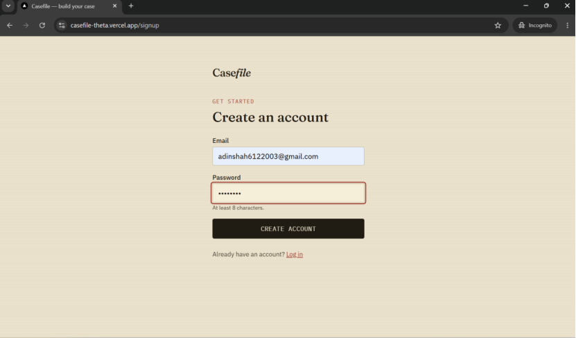
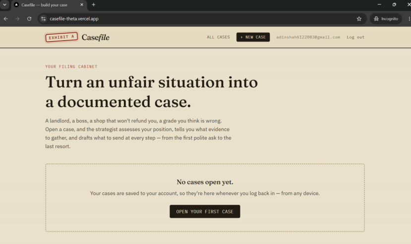
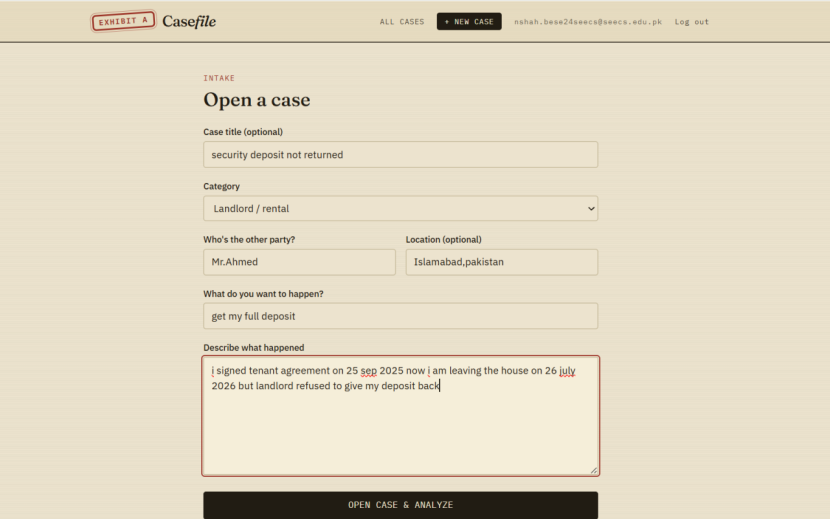
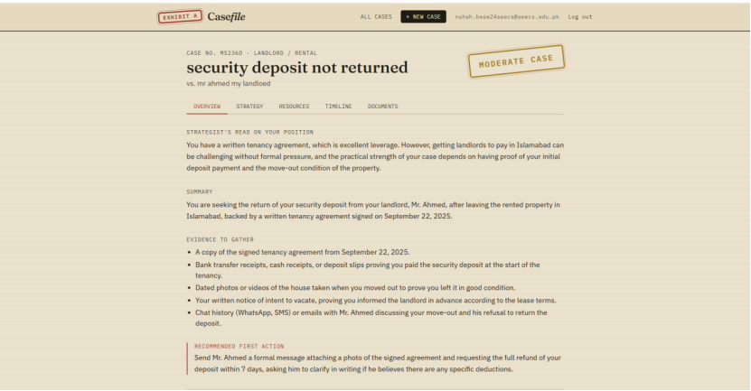
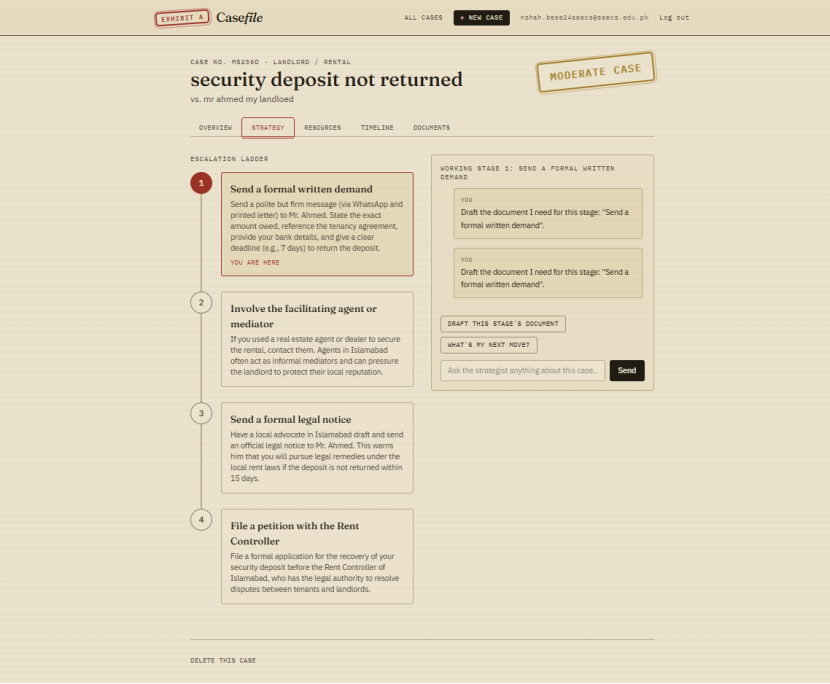
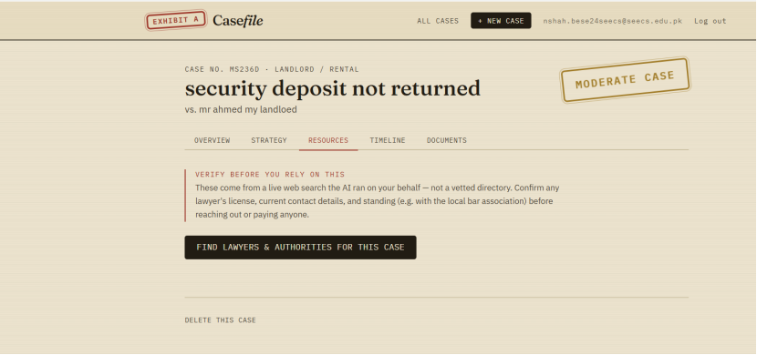
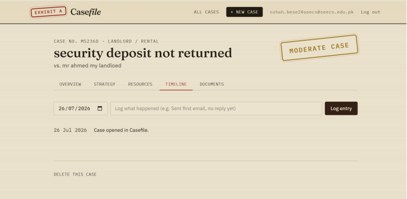
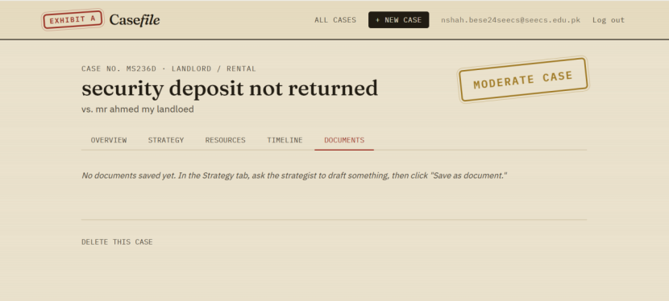

# Casefile — a pocket case strategist for everyday disputes

**Live app:** [casefile-theta.vercel.app](https://casefile-theta.vercel.app)
**GitHub repo:** [github.com/nidashah612/casefile](https://github.com/nidashah612/casefile)

## a. What it is, and who it's for

Most people who get wronged in a small, everyday way — a landlord who won't
return a security deposit, an employer who "forgets" to pay overtime, a shop
that refuses a refund it owes, a university that grades unfairly — have no
idea how to actually build a case. They don't know what evidence matters,
what to say, or when to escalate versus wait. So they either do nothing, or
they send one angry message that gets ignored and the matter dies there.

**Casefile turns "I got wronged" into an actual, working case file.** You
describe your dispute once. An AI case strategist reads it and:

- judges how strong your position realistically is,
- tells you exactly what evidence to gather (not generic advice — specific
  to your situation),
- builds a realistic **escalation ladder** (e.g. polite ask → formal written
  notice → regulatory complaint → small claims), and
- gives you one concrete first move.

From there, the case stays open. You log a timeline as things happen, and at
every stage you can ask the strategist for advice or have it **draft the
actual document** you need to send — in the right tone for how far things
have escalated — which you save straight into your case file.

This is built for **tenants, employees, customers, and students** — anyone
without a lawyer on speed dial who's dealing with someone who has more power
in the situation than they do.

## b. Live URL

👉 **[https://casefile-theta.vercel.app](https://casefile-theta.vercel.app)**

Sign up for a free account to try it — your cases are private to your
account and saved to a real database, so they're there whenever you log
back in from any device.

## c. Features

- **Case intake** — a short form describing the dispute, the other party,
  what you want, and where you are.
- **AI case analysis** — on submit, the strategist returns a structured
  read on your case: strength rating (strong / moderate / weak), a plain
  explanation of why, a summary, a list of specific evidence to collect, a
  tailored escalation ladder, and a recommended first action.
- **Escalation ladder** — a visual, clickable ladder of the realistic steps
  in your specific dispute. You move up it as things progress.
- **Stage-by-stage AI strategist chat** — ask for advice or ask it to draft
  the document for wherever you currently are on the ladder. The AI has
  your full case file as context and never invents facts you didn't give it.
- **One-click document drafting** — quick-action buttons ("Draft this
  stage's document", "What's my next move?") plus free-form chat.
- **Find local lawyers & authorities** — a Resources tab that has the AI run
  a live web search (Gemini's Google Search grounding) for the type of
  lawyer this dispute needs, the specific regulator/authority that handles
  it in the person's location, and any real firms or legal aid orgs the
  search actually turns up — with source links, and a clear "verify
  independently" disclaimer, since even grounded AI output can be wrong.
- **Document vault** — save any AI reply as a named document, view it full
  screen, copy it to send.
- **Timeline** — log dated entries every time you send something, hear
  back, or find new evidence, building your paper trail.
- **Multiple cases** — your "filing cabinet" home page lists every case
  you've opened, each stamped with its AI-assessed strength.
- **Accounts, with real persistence** — sign up with an email and password.
  Every case is saved to your account in a Postgres database, so it's there
  whenever you log back in, from any device. Passwords are hashed with
  bcrypt before they're ever stored; only you can see your own cases.

## d. The AI feature

The AI is the whole point of the app: it's a case strategist, not a generic
chatbot. It runs on **Google Gemini (`gemini-3.5-flash`)** via the
Google AI Studio API, called from two server-side routes so the API key is
never exposed to the browser.

**Moment 1 — opening a case** (`/api/analyze`, prompt in `lib/prompts.js` →
`CASE_ANALYST_SYSTEM_PROMPT`): given the dispute description, it must return
strict JSON — a strength rating, the reasoning behind it, a summary, a list
of concrete (not generic) evidence to gather, a 3–5 step escalation ladder
tailored to the dispute's domain, and one recommended first action. It's
explicitly instructed not to invent specific laws, statutes, or institutions
it isn't sure are real for the person's location, and to give exactly one
short "not a lawyer" disclaimer rather than hedging throughout.

**Moment 2 — working a case** (`/api/strategize`, prompt in
`lib/prompts.js` → `STRATEGIST_CHAT_SYSTEM_PROMPT`): a per-stage system
prompt that hands the model the full case file as ground truth and the
current escalation stage. It's instructed to draft full, ready-to-send
documents (matching tone to how serious the stage is) when asked, to give
short, case-specific advice otherwise, to never invent facts not in the case
file, and to say plainly when a question needs a real lawyer rather than
guessing at law it can't verify.

Both prompts are written from scratch for this app — you can read them in
full at [`lib/prompts.js`](./lib/prompts.js).

**Moment 3 — finding real help** (`/api/resources`, prompt in
`lib/prompts.js` → `LOCAL_RESOURCES_SYSTEM_PROMPT`): this call turns on
Gemini's **Google Search grounding tool**, so the model can't answer from
memory — it has to search and cite. It's instructed to never invent a
lawyer, firm, or agency name; every specific name in the reply has to come
from an actual search result, and if nothing verifiable turns up for the
person's location it has to say so rather than guess. The UI shows the
source links Gemini grounded on and a standing disclaimer to verify
everything independently.

## e. Tools, services, and models used

- **Framework:** Next.js 16 (App Router), React 19
- **Styling:** Tailwind CSS v4, custom "case-file dossier" design system
  (see `app/globals.css`) — hand-built, no UI kit
- **AI model:** Google Gemini `gemini-3.5-flash`, via the Google AI
  Studio REST API (`generativelanguage.googleapis.com`)
- **Auth:** Auth.js (NextAuth v5), email/password via a Credentials
  provider, JWT sessions, passwords hashed with `bcryptjs`
- **Request gatekeeping:** `proxy.js` (Next.js 16's replacement for the
  older `middleware.js` convention) — redirects logged-out visitors to
  `/login` and keeps logged-in visitors off the auth pages
- **Database:** Postgres (hosted on [Neon](https://neon.tech), connected to
  Vercel as an integration — any Postgres works), accessed with
  `@vercel/postgres`. Two tables: `users` and `cases` (each case's data
  stored as JSONB, scoped to its owner)
- **Hosting:** [Vercel](https://vercel.com)
- **Fonts:** Fraunces, IBM Plex Mono, IBM Plex Sans (self-hosted via
  `@fontsource`, no external font requests at runtime)
- Built with the help of Claude (Anthropic) as a coding assistant.

## f. Screenshots

**Sign up** — creating an account (email + password, at least 8 characters).


**Home — your filing cabinet** — every case you've opened, saved to your account.


**Opening a case** — the intake form: what happened, who's involved, what you want.


**Overview — the AI's read on your case** — strength rating, summary, specific
evidence to gather, and a recommended first action.


**Strategy — the escalation ladder and chat** — move through each stage and ask
the strategist for advice or a drafted document.


**Resources — finding real help** — the AI runs a live, grounded web search for
lawyers and authorities relevant to the case, with a clear disclaimer to verify
independently.


**Timeline** — log dated entries as the case progresses, building a paper trail.


**Documents** — save any AI-drafted reply here to view full-screen or copy and send.


## g. How to run this project

### 1. Get a free Gemini API key
Go to [aistudio.google.com/apikey](https://aistudio.google.com/apikey), sign
in with a Google account, and create an API key.

> **Free-tier note:** Google's free tier is rate-limited per Google Cloud
> project (not per key) — a small number of requests per day. If you hit a
> `429 RESOURCE_EXHAUSTED` error, either wait for the daily reset (check
> **Rate Limit** in the [AI Studio dashboard](https://aistudio.google.com))
> or enable billing on the project — Gemini Flash-Lite pricing is a
> fraction of a cent per request, so normal development/testing use costs
> a few cents at most.

### 2. Set up a Postgres database
Easiest path — use [Neon](https://neon.tech) (free tier) or Vercel's own
Postgres:
1. Create a free database (e.g. at [neon.tech](https://neon.tech), or in
   the Vercel dashboard under **Storage → Create Database → Postgres**).
2. Copy the **pooled** connection string (it should contain `-pooler` in
   the hostname) — you'll use it below.

The app creates its own tables automatically the first time it runs — no
manual migration step needed.

### 3. Run it locally
```bash
git clone https://github.com/nidashah612/casefile.git
cd casefile
npm install
cp .env.example .env.local
```
Open `.env.local` and fill in three values:
```
GEMINI_API_KEY=your-google-ai-studio-key
AUTH_SECRET=any-long-random-string     # e.g. output of: openssl rand -base64 32
POSTGRES_URL=your-postgres-connection-string
```
Then:
```bash
npm run dev
```
Open [http://localhost:3000](http://localhost:3000), sign up for an
account, and you're in.

> **Note:** this project uses `next-auth@5.0.0-beta.25`, which hasn't yet
> published a peer-dependency range covering Next.js 16. An `.npmrc` file
> with `legacy-peer-deps=true` is included so `npm install` doesn't fail on
> that mismatch — no action needed, just don't delete that file.

### 4. Push to GitHub (must be public)
```bash
git init
git add .
git commit -m "Casefile: AI case strategist app"
git branch -M main
git remote add origin https://github.com/nidashah612/casefile.git
git push -u origin main
```
Make sure the repo's visibility is **Public** in GitHub's settings.
`.env.local` is already git-ignored — double check no key ended up
committed before you push.

### 5. Deploy to Vercel
1. Go to [vercel.com/new](https://vercel.com/new) and import the GitHub repo.
2. If you're using Neon, connect it as an integration (**Storage →
   Connect Database → Neon**) — this automatically injects `POSTGRES_URL`
   for you. If you created a Vercel Postgres database instead, connect it
   the same way from **Storage**.
3. In the project's **Settings → Environment Variables**, add the other
   two (this step is easy to miss — the app won't work without them):
   - `GEMINI_API_KEY` = your Google AI Studio key
   - `AUTH_SECRET` = the same random string you generated above (or a new
     one — just make sure it's set)
4. Deploy. Vercel auto-detects Next.js — no build config needed.
5. **After adding environment variables to an already-deployed project,**
   you must trigger a **Redeploy** (Deployments tab → "⋯" on the latest
   deployment → Redeploy) — adding env vars alone doesn't apply them to a
   deployment that already ran.

## Project structure
```
auth.js                      Auth.js (NextAuth v5) config — credentials login
proxy.js                      protects pages, redirects based on login state
                              (Next.js 16's renamed middleware.js convention)
.npmrc                        legacy-peer-deps=true (next-auth v5 beta / Next 16)
app/
  page.js                     home — list of your cases
  login/page.js                log in
  signup/page.js               create an account
  new/page.js                  case intake form
  case/[id]/page.js            case detail (overview, strategy, timeline, docs)
  api/analyze/route.js         AI: initial case analysis (structured JSON)
  api/strategize/route.js      AI: stage chat + document drafting
  api/resources/route.js       AI: grounded search for lawyers/authorities
  api/auth/signup/route.js     creates a new user (hashes the password)
  api/auth/[...nextauth]/route.js   Auth.js route handlers
  api/cases/route.js           list / create cases for the logged-in user
  api/cases/[id]/route.js      get / update / delete a single case
lib/
  prompts.js                   the two system prompts — the actual AI feature
  gemini.js                    Gemini API call wrapper
  db.js                        Postgres queries (users, cases)
  storage.js                   client-side wrapper that calls the cases API
components/                    UI components (ladder, chat, stamp, timeline, docs)
```

## Limitations & honest notes
- This is not legal advice, and the app says so. It's meant to help someone
  organize their thinking and communicate effectively, not replace a lawyer
  for anything serious.
- No email verification or password reset flow — it's a straightforward
  email/password Credentials setup, which is enough to prove real
  persistence per account but isn't a production-grade auth system.
- Runs on Google Gemini's free API tier by default, which has a modest
  daily request cap shared across an entire Google Cloud project. For
  heavier or more reliable use, enable billing on the project (see step 1
  above) — typical usage costs a few cents.
